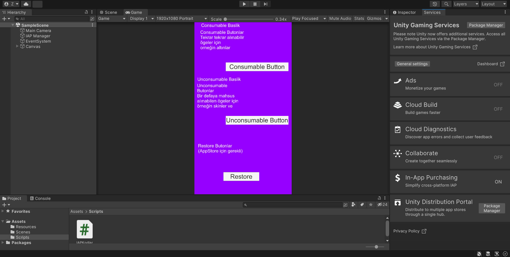

# OyunIciSatinAlma2
IAP butonları ile oluşturulmuş oyun içi satın alma 
 
Bu proje Unity aracıyla C# dilinde kodlanmış oyun içi satın almıların IAP butonlarıyla tasarlanmış halidir.Özelleştirilebilir.
 
  
       
Sahne Görünüşü :

        
İlk buton consumable ögeler içindir.Consumable ögeler tekrar satın alınabilen ögeledir. IAP ı projenize dahil ettiğinizde otomatik olarak ekleyebilirsiniz.
 
         
İkinci buton unconsumable ögeler içindir.Unconsumable ögeler tekrar satın alınamayan ögeledir. IAP ı projenize dahil ettiğinizde otomatik olarak ekleyebilirsiniz.
 
          
Üçüncü buton restore butonudur.Bu buton App Storeda oyununuzu yayınlayacaksanız gereklidir. IAP ı projenize dahil ettiğinizde otomatik olarak ekleyebilirsiniz.
 
         
         
